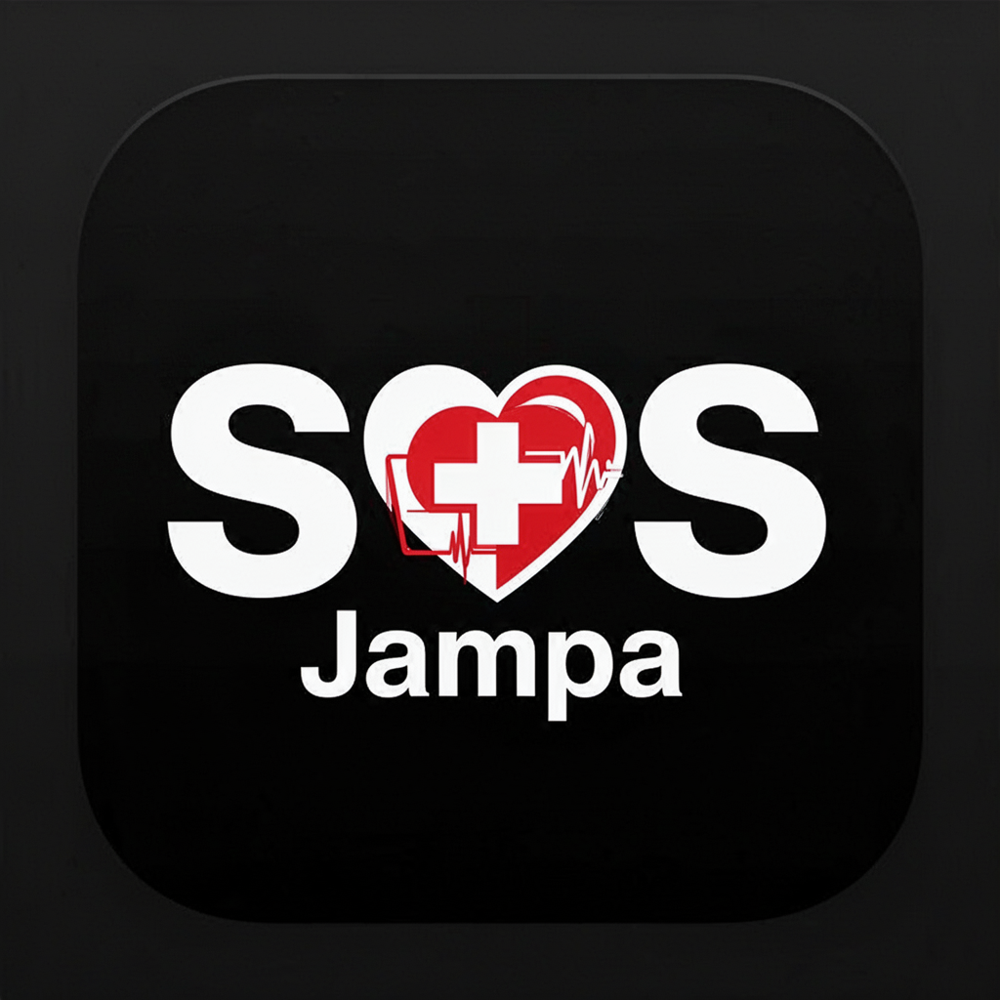
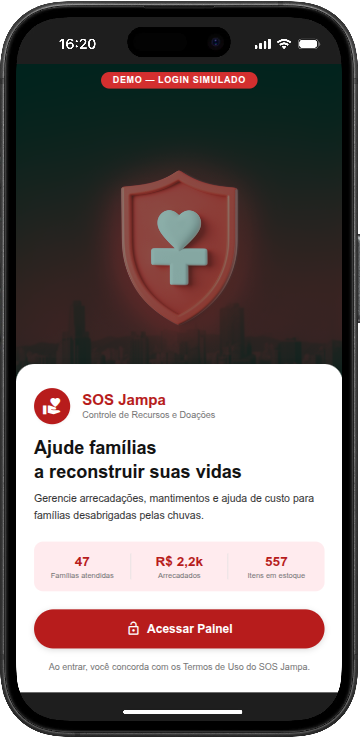
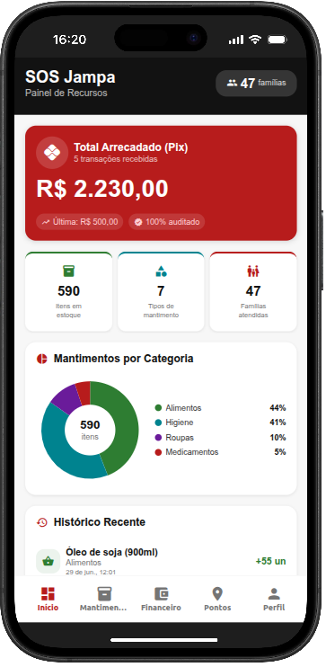
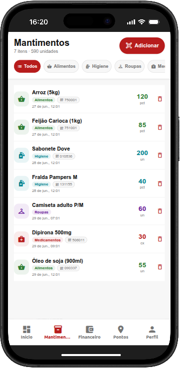
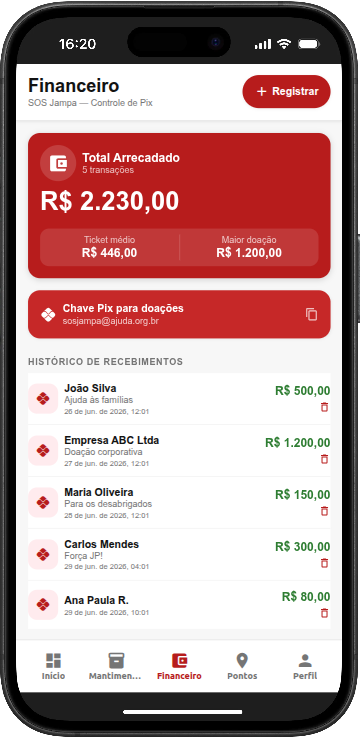
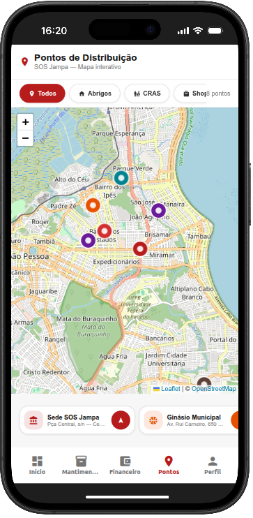
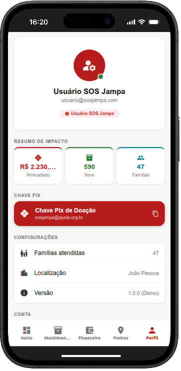

# ⛑️ SOS Jampa — Gestão Humanitária e Ajuda Emergencial

<div align="center">



### Plataforma mobile para coordenação de doações, distribuição de mantimentos e auxílio emergencial a famílias em João Pessoa - PB.

[](https://expo.dev/)
[](https://reactnative.dev/)
[](https://www.typescriptlang.org/)
[](https://docs.expo.dev/router/introduction/)
[](https://supabase.com/)
[](#-mapa-interativo-e-pontos-de-arrecadação)

[Visão Geral](#-sobre-o-projeto) •
[Protótipos & Telas](#-protótipo-e-telas-da-aplicação) •
[Funcionalidades](#-funcionalidades-principais) •
[Arquitetura](#-arquitetura-e-tecnologias) •
[Execução Local](#-como-executar-o-projeto) •
[Transparência](#-auditoria-e-relatórios)

</div>

---

## 📌 Sobre o Projeto

O **SOS Jampa** é uma aplicação mobile humanitária desenvolvida para conectar voluntários, entidades civis e doadores em situações emergenciais (como enchentes, alagamentos e desastres climáticos sazonais) na cidade de **João Pessoa - PB**.

A plataforma resolve o gargalo crítico da gestão de crises: a **falta de visibilidade em tempo real sobre estoques de mantimentos, distribuição de auxílios e localização de abrigos**. Por meio de uma interface intuitiva, recursos de geolocalização e automação de relatórios, o SOS Jampa proporciona máxima agilidade no socorro e transparência total na prestação de contas de cada centavo e quilo de donativo arrecadado.

---

## 📱 Protótipo e Telas da Aplicação

Confira abaixo as telas do aplicativo em execução, demonstrando o fluxo operacional completo — desde o onboarding até a prestação de contas pública:

| **01. Acesso & Onboarding** | **02. Painel em Tempo Real** | **03. Gestão de Mantimentos** |
|:---:|:---:|:---:|
|  |  |  |
| **Boas-vindas & Propósito**<br>Apresentação da causa humanitária, contadores de impacto global e acesso autenticado. | **Dashboard de Controle**<br>Total arrecadado via Pix auditado, métricas de estoque e gráfico de doações por categoria. | **Inventário Inteligente**<br>Controle por categorias (Alimentos, Higiene, Roupas, Remédios) e leitor de código de barras. |

| **04. Controle Financeiro (Pix)** | **05. Mapa de Distribuição** | **06. Perfil & Transparência** |
|:---:|:---:|:---:|
|  |  |  |
| **Auditoria & Doações Pix**<br>Rastreabilidade de transferências, chave Pix com cópia em 1 clique e métricas de ticket médio. | **Pontos Georreferenciados**<br>Mapeamento de abrigos, postos de coleta e CRAS em João Pessoa (Leaflet/Maps). | **Transparência & Gestão**<br>Resumo individual de impacto social, dados de voluntariado e configurações de sistema. |

---

## ✨ Funcionalidades Principais

### 📊 1. Painel de Controle e Indicadores em Tempo Real
- **Métricas Instantâneas**: Total financeiro recebido, volume total de itens em estoque, tipos de suprimentos catalogados e número de famílias amparadas.
- **Gráfico de Donativos por Categoria**: Visualização em gráfico de rosca (Donut Chart) distribuindo proporções de *Alimentos*, *Higiene*, *Roupas*, *Medicamentos* e outros.
- **Linha do Tempo Recente**: Acompanhamento cronológico de qualquer nova entrada no sistema.

### 📦 2. Gestão de Estoque e Mantimentos com Leitor Óptico
- **Categorização Visual Dinâmica**: Badges com cores padronizadas para identificação imediata de cada categoria de necessidade.
- **Código de Barras / QR Code**: Integração com a câmera do dispositivo via `expo-camera` para escaneamento rápido e conferência de itens no ato do recebimento.
- **Controle Preciso de Unidades**: Gerenciamento de fardos, pacotes, caixas, quilos e litros com baixa e incremento facilitados.

### 💳 3. Arrecadação Financeira & Auditoria Pix 100% Rastreável
- **Transparência Absoluta**: Cada transação Pix registra valor, nome/razão social do doador, propósito da doação e carimbo de data/hora (`timestamp`).
- **Indicadores Financeiros**: Total líquido arrecadado, ticket médio de doação e registro do maior aporte recebido.
- **Compartilhamento Ágil de Chave Pix**: Cópia com 1 toque da chave oficial da campanha para facilitar a divulgação nas redes sociais.

### 👨‍👩‍👧‍👦 4. Cadastro e Assistência às Famílias Atingidas
- **Mapeamento Familiar**: Registro de famílias desabrigadas, quantidade de membros, endereço de acolhimento e contatos de urgência.
- **Histórico de Atendimentos**: Rastreio granular de quais mantimentos foram entregues ou repasses financeiros foram direcionados a cada núcleo familiar.
- **Classificação de Status**: Acompanhamento do ciclo de vida (*Em Atendimento*, *Parcialmente Atendido*, *Atendido*).

### 🗺️ 5. Mapa Interativo e Pontos de Arrecadação
- **Geolocalização Integrada**: Mapa dinâmico de João Pessoa (`react-leaflet` / `react-native-maps`) identificando a localização exata de:
  - Sede Central SOS Jampa;
  - Ginásios Municipais e Abrigos Temporários;
  - Unidades do CRAS (Centro de Referência de Assistência Social);
  - Pontos de Coleta Voluntários em shoppings e praças.
- **Filtros por Tipo de Ponto & Rotas**: Navegação facilitada com cálculo de proximidade a partir da posição do voluntário via `expo-location`.

### 📑 6. Prestação de Contas e Relatórios Automatizados
- **Gerador de Relatórios em PDF/HTML**: Motor integrado em [`services/reportService.ts`](file:///home/devsec/www/SAAS/sos-jampa/services/reportService.ts) que compila automaticamente relatórios completos contendo:
  - Balanço financeiro auditado;
  - Inventário discriminado de estoque com gráficos de preenchimento percentual;
  - Tabela completa de famílias assistidas e suas respectivas entregas;
  - Exportação e compartilhamento nativo via `expo-print` e `expo-sharing`.

---

## 🛠️ Arquitetura e Tecnologias

A aplicação foi projetada sobre um ecossistema moderno, orientado a alta performance e prontidão multiplataforma (Android, iOS e Web):

- **Core Mobile**: [React Native 0.79](https://reactnative.dev/) com suporte nativo à New Architecture (`newArchEnabled: true`) e [React 19](https://react.dev/).
- **Plataforma & Tooling**: [Expo SDK 53](https://expo.dev/) com [Expo Router 5](https://docs.expo.dev/router/introduction/) (File-system based routing tipado).
- **Linguagem**: [TypeScript 5.8](https://www.typescriptlang.org/) garantindo tipagem estrita de ponta a ponta.
- **Estilização**: [NativeWind (Tailwind CSS)](https://www.nativewind.dev/) aliado a temas padronizados em [`constants/theme.ts`](file:///home/devsec/www/SAAS/sos-jampa/constants/theme.ts).
- **Mapas & Geodados**: Leaflet, React Leaflet, React Native Maps e `expo-location`.
- **Gráficos & Animações**: `react-native-chart-kit`, `react-native-svg`, `react-native-reanimated` e `lottie-react-native`.
- **Persistência de Dados**:
  - Camada local: `@react-native-async-storage/async-storage` e `expo-sqlite` para operação confiável mesmo sem conexão imediata com a internet (offline-first).
  - Camada de nuvem: `@supabase/supabase-js` para sincronização em nuvem.
- **Hardware & Periféricos**: `expo-camera` (leitura de código de barras), `expo-haptics` (feedback tátil) e `expo-clipboard` (cópia de chaves Pix).

---

## 📂 Estrutura do Projeto

```text
sos-jampa/
├── app/                      # Rotas e Telas (Expo Router)
│   ├── (tabs)/               # Navegação principal em abas
│   │   ├── _layout.tsx       # Configuração da barra inferior de abas
│   │   ├── index.tsx         # Início / Dashboard geral de indicadores
│   │   ├── supplies.tsx      # Mantimentos / Inventário e leitura de donativos
│   │   ├── finance.tsx       # Financeiro / Doações Pix e auditoria
│   │   ├── families.tsx      # Famílias / Cadastro e registro de atendimentos
│   │   ├── map.tsx           # Pontos / Mapa interativo georreferenciado
│   │   └── profile.tsx       # Perfil / Resumo de impacto e transparência
│   ├── login.tsx             # Autenticação de voluntários e gestores
│   ├── onboarding.tsx        # Apresentação do projeto e acolhimento
│   └── _layout.tsx           # Layout raiz com provedores de contexto
├── assets/                   # Ícones, imagens de apresentação e splash screen
├── components/               # Componentes reutilizáveis de interface (UI)
├── constants/                # Tokens de design, cores, tipografia e temas
├── contexts/                 # Gerenciamento de estado global (DataContext, AuthContext)
├── docs/                     # Registros fotográficos e telas de protótipo
│   ├── tela01.png            # Onboarding & Acesso
│   ├── tela02.png            # Dashboard
│   ├── tela03.png            # Gestão de Mantimentos
│   ├── tela04.png            # Controle Financeiro Pix
│   ├── tela05.png            # Mapa de Distribuição em João Pessoa
│   └── tela06.png            # Perfil & Transparência
├── services/                 # Serviços auxiliares e gerador de relatórios em PDF
└── package.json              # Configurações do projeto e dependências
```

---

## 🚀 Como Executar o Projeto

### Pré-requisitos
- [Node.js](https://nodejs.org/) (versão 18 ou superior recomendada)
- Gerenciador de pacotes: [pnpm](https://pnpm.io/) (recomendado), `npm` ou `yarn`
- Dispositivo físico com o app **Expo Go** ([Android](https://play.google.com/store/apps/details?id=host.exp.exponent) / [iOS](https://apps.apple.com/app/expo-go/id982107779)) ou um emulador devidamente configurado.

### Passo a Passo

1. **Clone o repositório:**
   ```bash
   git clone https://github.com/seu-usuario/sos-jampa.git
   cd sos-jampa
   ```

2. **Instale as dependências:**
   ```bash
   pnpm install
   # ou: npm install
   ```

3. **Inicie o servidor de desenvolvimento Expo:**
   ```bash
   pnpm start
   # ou: npx expo start
   ```

4. **Execução nos ambientes:**
   - **Dispositivo Físico:** Abra o aplicativo **Expo Go** e escaneie o QR Code exibido no terminal.
   - **Emulador Android:** Pressione `a` no terminal (ou execute `pnpm android`).
   - **Simulador iOS (macOS):** Pressione `i` no terminal (ou execute `pnpm ios`).
   - **Versão Web:** Pressione `w` no terminal (ou execute `pnpm web`).

---

## 📊 Auditoria e Relatórios

A confiabilidade é o pilar central do projeto. Qualquer coordenador da ação emergencial pode exportar um relatório consolidado com um único clique na aplicação. O documento é gerado diretamente no dispositivo com:

1. **Sumário Executivo**: Total arrecadado, total de mantimentos e total de famílias amparadas.
2. **Gráfico Percentual de Suprimentos**: Proporção por tipo de recurso em estoque.
3. **Livro-Razão Pix**: Discriminação de cada crédito recebido com data, emissor e valor.
4. **Relatório de Atendimentos**: Lista de cada família beneficiada e o respectivo donativo entregue.

---

### 📲 Funcionamento
[Gravação de tela de 26-09-2026 02:58:16.webm](https://github.com/user-attachments/assets/366f03a1-4e0a-4dd5-b14c-cf9107d43074)

---

## 🤝 Como Contribuir

Iniciativas humanitárias prosperam com o esforço comunitário. Sinta-se convidado a contribuir:

1. Faça um **Fork** do projeto.
2. Crie uma branch para sua funcionalidade ou correção:
   ```bash
   git checkout -b feature/minha-melhoria
   ```
3. Realize seus commits com descrições objetivas:
   ```bash
   git commit -m "feat: adiciona filtro por bairro no mapa de distribuicao"
   ```
4. Envie as alterações para sua branch remota:
   ```bash
   git push origin feature/minha-melhoria
   ```
5. Abra um **Pull Request**.

---

## ⚖️ Licença

Este projeto é disponibilizado sob a licença **MIT** — sinta-se livre para utilizar, adaptar e distribuir para auxiliar comunidades em qualquer região do Brasil ou do mundo.

---

<div align="center">
  <sub>Construído com solidariedade e tecnologia para apoiar João Pessoa - PB. 💙</sub>
</div>
